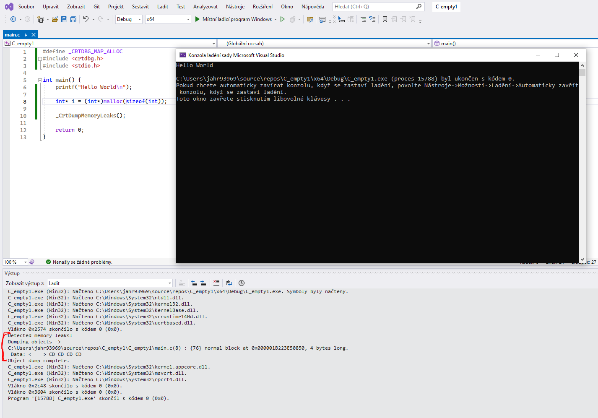

# Good to know

## Funkce __CrtDumpMemoryLeaks()_

Tato funkce je součástí knihovny Visual C++ Runtime (CRT) a slouží k detekci paměťových úniků v programu, který je vyvíjen v prostředí _Microsoft Visual C++_ / _Microsoft Visual Studio_.

Funkce `_CrtDumpMemoryLeaks()` slouží k nalezení paměťových úniků, což jsou části paměti, které byly dynamicky alokovány během běhu programu, ale nebyly správně uvolněny před ukončením programu. Tato funkce umožňuje programátorovi zobrazit zprávu o paměťových únicích, které byly detekovány během běhu programu, což může být užitečné při ladění a opravování paměťových chyb.

Použití funkce `_CrtDumpMemoryLeaks()` je obvykle součástí procesu ladění a testování aplikace vyvíjené v jazyce C.

### Ukázka použití

```c
#define _CRTDBG_MAP_ALLOC
#include <crtdbg.h>
#include <stdio.h>

int main() {
      printf("Hello World\n");

      int* i = (int*)malloc(sizeof(int));

      _CrtDumpMemoryLeaks();

      return 0;
}
```

Je důležité poznamenat, že používání `_CrtDumpMemoryLeaks()` je především pro účely ladění a testování a nemělo by být používáno v produkčním kódu, protože může generovat falešné pozitivy nebo negativy a může mít negativní dopad na výkon aplikace. Je také důležité zajistit, že vývojový kód je správně uvolňuje všechnu alokovanou paměť před ukončením programu, aby se minimalizovaly paměťové úniky.

